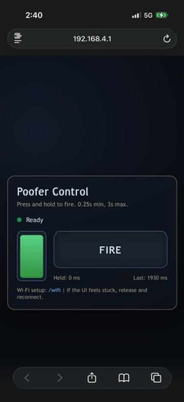
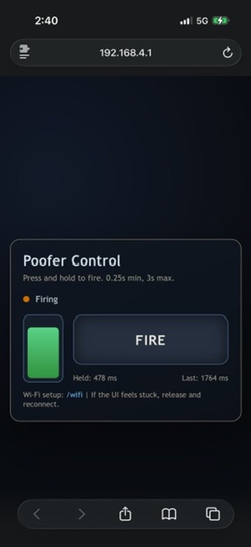

# Poofer Firmware (ESP32-C3 Super Mini)


Firmware and UI for a two-poofer, 3-channel WiSeFire 1.1-driven controller built on an ESP32-C3 Super Mini.

## Quick Start

For a full setup guide, see `INSTALL.md`.

Condensed steps:

- Install ESP-IDF 5.5.x and ensure `idf.py` is on your PATH.
- Optional: copy `.env.example` to `.env` to set defaults like `POOFER_SERIAL_PORT`.
- Build: `python3 scripts/build.py`
- Flash: `python3 scripts/flash.py --port /dev/cu.usbmodemXXXX`
- Monitor: `python3 scripts/monitor.py --port /dev/cu.usbmodemXXXX`
- Connect to AP `Poofer-AP` and open `http://192.168.4.1/`

## Hardware

- ESP32-C3 Super Mini dev board: https://www.amazon.com/dp/B0D4QK5V74
- Solenoid: https://www.amazon.com/dp/B00DQ1J4H0
- Power supply (12V): https://www.amazon.com/dp/B0D9D5L3B5
- Custom PCB with 3x WiSeFire 1.1 connections
- Full Bill of Materials: `BOM.md`

## Wiring And LED Mapping

GPIO4 drives a 3-pixel WS2812 chain.

- Pixel 0 is a physical on-board LED soldered to the ESP32 board.
- Pixel 1 is a virtual pixel used for Poofer 1 solenoid control via the custom PCB.
- Pixel 2 is a virtual pixel used for Poofer 2 solenoid control via the custom PCB.
This mapping is intentional and should be preserved. The firmware treats the chain as three pixels.
The firmware drives the selected output pixel as white (`R=G=B`). On the WiSeFire board, Pixel 1 white
fires solenoids 1 and 2 for Poofer 1, and Pixel 2 white fires solenoid 3 for Poofer 2.

## Architecture

- AP + STA Wi-Fi mode
- SPIFFS for UI assets
- HTTP server for UI pages and Wi-Fi form
- WebSocket control channel
- NVS storage for STA credentials
- mDNS hostname `poofer`

## Web UI

- Control UI: `http://192.168.4.1/`
- Wi-Fi setup: `http://192.168.4.1/wifi`
- mDNS after STA join: `http://poofer.local/`

### UI Screenshots

Ready state:



Firing state:



## WebSocket Protocol

Messages from client to device:

- `DOWN 1` starts a Poofer 1 press
- `UP 1` ends a Poofer 1 press
- `DOWN 2` starts a Poofer 2 press
- `UP 2` ends a Poofer 2 press
- `DOWN` and `UP` are accepted as legacy aliases for Poofer 1
- `PING` requests a state update

State messages from device to client:

```json
{
  "ready": true,
  "firing": false,
  "error": false,
  "connected": true,
  "elapsed_ms": 0,
  "last_hold_ms": 250,
  "active_poofer": 0,
  "poofers": [
    {"id": 1, "firing": false, "last_hold_ms": 250},
    {"id": 2, "firing": false, "last_hold_ms": 250}
  ]
}
```

## Configuration

Defaults are defined in `firmware/main/main.c`.

- AP SSID and password
- GPIO pin for the LED/solenoid chain
- Minimum and maximum hold times (0.25s min, 3s max)
- mDNS hostname and HTTP routes
- Status LED colors: green = ready, orange = firing, blue = disconnected, red = fault

## Development

- Linting entry point: `scripts/lint.sh`
- Git hooks: `pre-commit install`

## Releases

Firmware artifacts are built in CI for tags matching `fw-*`.

The workflow uploads these files as artifacts:

- `bootloader.bin`
- `partition-table.bin`
- `poofer.bin`
- `spiffs.bin`
- `flasher_args.json` and `*_flash_args` helpers

Create a release tag:

```bash
scripts/release_tag.sh 1.0.0
```

## Config

Optional local config is supported via `.env`.

- Copy `.env.example` to `.env`
- Set `POOFER_IDF_PATH`, `POOFER_SERIAL_PORT`, and any optional overrides

## Safety

TODO: Add explicit safety guidelines and operational constraints.

## License

MIT. See `LICENSE`.
